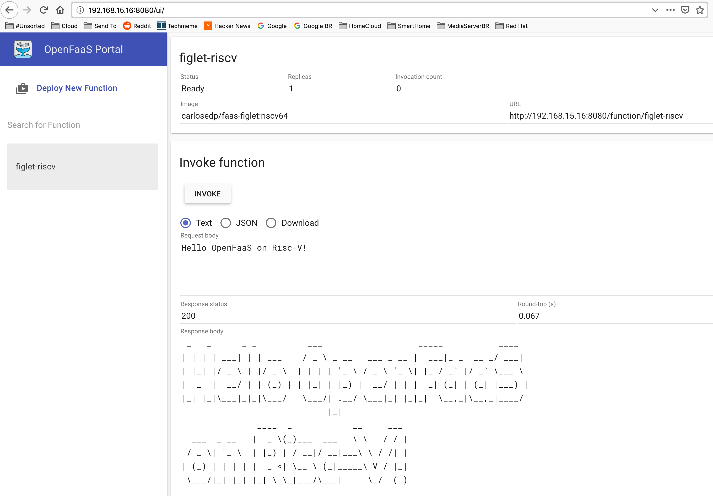

# Deploying OpenFaaS on Risc-V

I've built and pushed to my [DockerHub account](https://hub.docker.com/r/carlosedp) the required images to run OpenFaaS on Risc-V architecture.

## Requirements

You will need a Risc-V host that can be either the SiFive Unleashed SBC or a Qemu VM. You also need Docker installed into it.

For both, you can check the links and download on the [Risc-V tracker page](https://github.com/carlosedp/riscv-bringup#virtual-machine-pre-built-go-and-docker).

## Deploying OpenFaaS

Enable Swarm mode on Docker with `docker swarm init`.

Get the faas-cli pre-built for Risc-V from [here](https://github.com/carlosedp/riscv-bringup/releases/download/v1.0/faas-cli-riscv64.gz).

Download both files below (`deploy_stack.sh` and `docker-compose.riscv64.yml`). They will deploy the OpenFaaS stack into your local Docker.

```bash
# Install faas-cli
curl -O https://github.com/carlosedp/riscv-bringup/releases/download/v1.0/faas-cli-riscv64.gz
gzip -d faas-cli-riscv64.gz
sudo cp faas-cli-riscv64 /usr/local/bin/faas-cli
sudo chmod +x /usr/local/bin/faas-cli
# Deploy OpenFaaS
curl -O https://gist.githubusercontent.com/carlosedp/f07403da2a89f396aa4a05663f77a2d3/raw/85f3d5441ba7d8f159b85274f50e9c08f6b71f3d/docker-compose.riscv64.yml
curl -O https://gist.githubusercontent.com/carlosedp/f07403da2a89f396aa4a05663f77a2d3/raw/85f3d5441ba7d8f159b85274f50e9c08f6b71f3d/deploy_stack.sh
chmod +x deploy_stack.sh
./deploy_stack.sh
```

It will print the user and password used to authenticate into OpenFaaS.

## Testing

Login with the command generated before(change your password hash):

```
$ echo -n c9bf115a97d6b727f3664f54350f29699c4117724bd63277a18d3116f8fa077a | faas-cli login --username=admin --password-stdin
```

Check the stack status with `docker service ls`. It should present something like:

```
$ docker service ls

ID                  NAME                     MODE                REPLICAS            IMAGE                                      PORTS
xnjpmzk2qz1h        figlet-riscv             replicated          1/1                 carlosedp/faas-figlet:riscv64
6ped0rp5o7wl        func_basic-auth-plugin   replicated          1/1                 carlosedp/faas-basic-auth-plugin:riscv64
miqugvtf5mbs        func_faas-swarm          replicated          1/1                 carlosedp/faas-swarm:riscv64
w18qv4h2qhcn        func_gateway             replicated          1/1                 carlosedp/faas-gateway:riscv64             *:8080->8080/tcp
vucvfujpikec        func_nats                replicated          1/1                 carlosedp/faas-nats-streaming:riscv64
o1dxdbfmkoaw        func_queue-worker        replicated          0/1                 carlosedp/queue-worker:riscv64
```

Now you can open the Gateway GUI by browsing to [http://[your_box_IP]:8080/ui/](http://[your_box_IP]:8080/ui/).


To deploy a sample function, Figlet in this case, do:

```
$ faas-cli deploy --image carlosedp/faas-figlet:riscv64 --name figlet-riscv
```

Check if available and test the function in the GUI or in CLI with:



```
$ faas-cli ls

Function                      	Invocations    	Replicas
figlet-riscv                  	0              	1

$ echo "Hello OpenFaaS from RiscV" | faas-cli invoke figlet-riscv

 _   _      _ _          ___                   _____           ____
| | | | ___| | | ___    / _ \ _ __   ___ _ __ |  ___|_ _  __ _/ ___|
| |_| |/ _ \ | |/ _ \  | | | | '_ \ / _ \ '_ \| |_ / _` |/ _` \___ \
|  _  |  __/ | | (_) | | |_| | |_) |  __/ | | |  _| (_| | (_| |___) |
|_| |_|\___|_|_|\___/   \___/| .__/ \___|_| |_|_|  \__,_|\__,_|____/
                             |_|
  __                       ____  _        __     __
 / _|_ __ ___  _ __ ___   |  _ \(_)___  __\ \   / /
| |_| '__/ _ \| '_ ` _ \  | |_) | / __|/ __\ \ / /
|  _| | | (_) | | | | | | |  _ <| \__ \ (__ \ V /
|_| |_|  \___/|_| |_| |_| |_| \_\_|___/\___| \_/

```

That's it, to deploy new functions, you need to build the base containers and it's applications for the Risc-V architecture.
